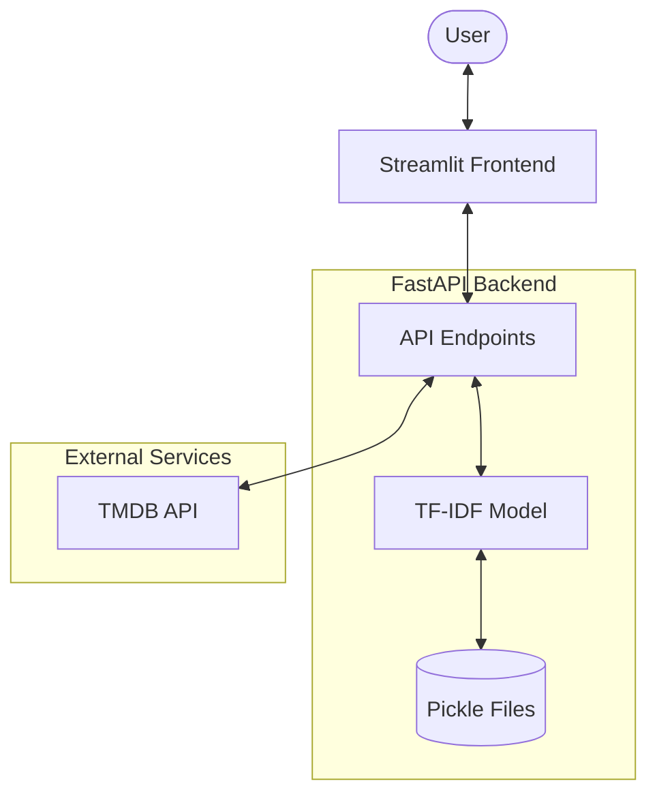
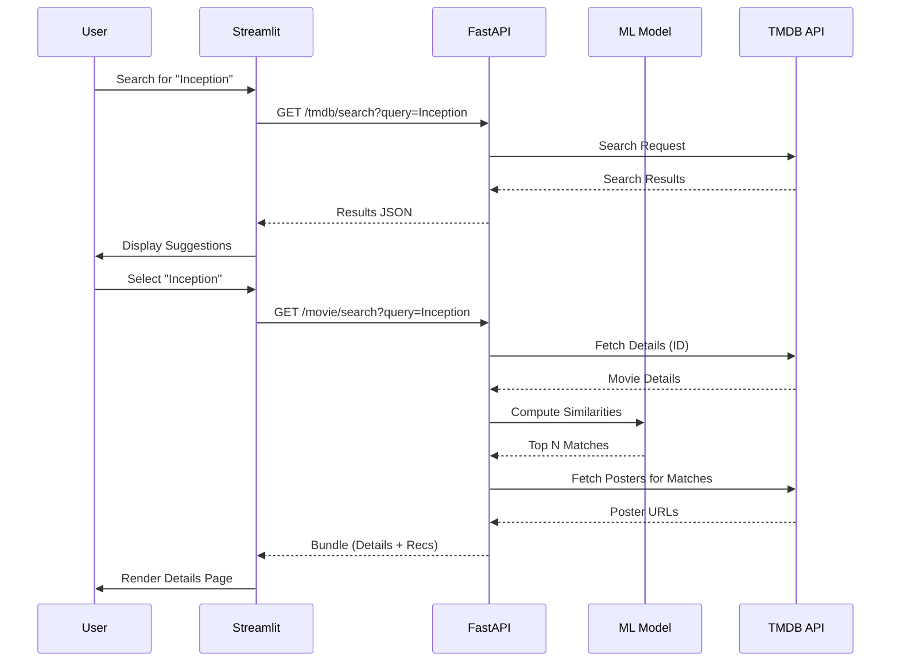

# Project Architecture: Movie Recommender

This document outlines the architecture and data flow of the Movie Recommender system.

## Overview

The system follows a decoupled architecture with a **Streamlit** frontend and a **FastAPI** backend. It combines local Machine Learning (TF-IDF similarity) with dynamic data from the **TMDB (The Movie Database)** API.

## System Architecture

## Component Details

### 1. Frontend (Streamlit) - `app.py`
- **User Interface**: Provides a modern, responsive web interface for movie discovery.
- **State Management**: Uses `st.session_state` and query parameters for navigation between "Home" and "Details" views.
- **Caching**: Implements `st.cache_data` to reduce redundant API calls.
- **API Client**: Communicates with the backend using the `requests` library.

### 2. Backend (FastAPI) - `main.py`
- **REST API**: Exposes endpoints for searching, fetching details, and generating recommendations.
- **Asynchronous Processing**: Uses `httpx` for non-blocking calls to the TMDB API.
- **CORS**: Configured to allow requests from the frontend.

### 3. Recommendation Engine
- **TF-IDF Similarity**:
    - Uses a precomputed TF-IDF matrix (`tfidf_matrix.pkl`) and vectorizer (`tfidf.pkl`).
    - Calculates cosine similarity between movies based on descriptions/metadata.
    - Loads data into memory during startup for high performance.
- **Genre Discovery**: Fallback or complementary recommendations fetched dynamically from TMDB based on movie genres.

### 4. Data Layer
- **Local Metadata**: `df.pkl` (dataframe) and `indices.pkl` (title-to-index mapping).
- **External Data**: Real-time movie details, posters, and trending lists are fetched from **TMDB**.

## Data Flow (Recommendation Search)

## Tech Stack
- **Frontend**: Streamlit
- **Backend**: FastAPI, Uvicorn
- **Machine Learning**: Scikit-learn, NumPy, Pandas
- **API Client**: Httpx (Backend), Requests (Frontend)
- **External API**: TMDB
